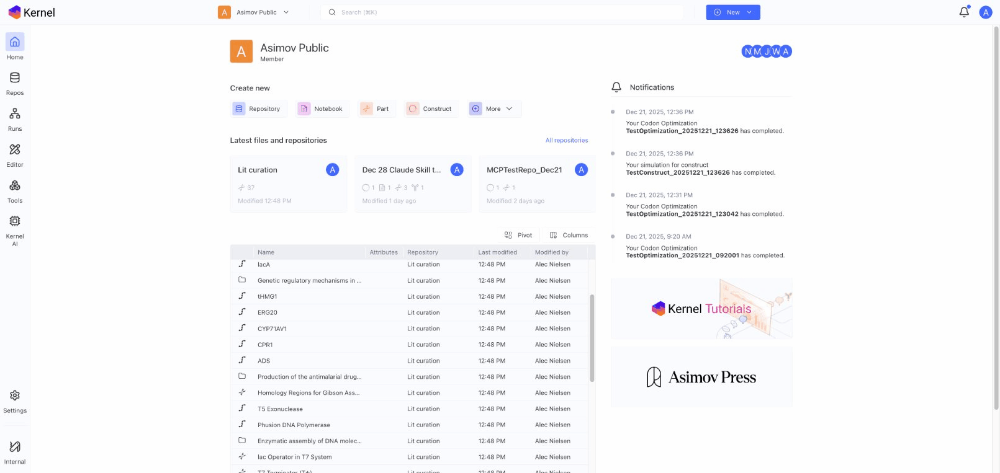

# Welcome to Kernel

Kernel is Asimov's genetic design platform for engineering biology. It combines sequence design tools, team collaboration features, and workflow automation to accelerate the development of biotechnologies.

## Core Capabilities

### Predictive Models

Kernel includes powerful models to accelerate your design process:

* **Genetic Simulation** — Predict RNA polymerase flux, ribosome flux, and protein concentrations for your constructs
* **Compiler** — Automatically design expression vectors from antibody sequences using AI-powered codon optimization, signal peptide prediction, and expert design rules

### Genetic Design Tools

* Design genetic constructs using an intuitive, parts-based approach
* View designs in multiple formats: linear sequence, circular map, and interactive schematic
* Access integrated tools including codon optimization, biosecurity sequence analysis, and genetic simulation
* Leverage AI-assisted design support with Kernel AI

### Collaborative Workspaces

* Create team workspaces where members can collaborate on projects
* Manage construct designs, genetic parts, and notebooks in repositories with granular permissions
* Share constructs, parts, and protocols securely within and across teams
* Access public repositories:
  * Asimov Public — curated genetic parts
  * UniProt Swiss-Prot — protein sequences
  * Addgene — plasmid repository

### Automated Workflows

* Generate expression vectors automatically with the configurable genetic Compiler
* Import sequences with automatic part annotation mapping
* Run genetic simulations to predict expression behavior
* Track samples and experiments with the integrated inventory system

### Documentation & Knowledge Management

* Document experiments in electronic lab notebooks
* Create and share standardized protocols
* Link documentation, data, and images directly to sequence designs
* Search across all workspace content

## Getting Started

Ready to begin? Check out our [Quick Start Guide](getting-started/quick-start.md) to create your first workspace and start designing.

## Documentation Overview

| Section | Description |
|---------|-------------|
| [Getting Started](getting-started/quick-start.md) | Quick start, core concepts, UI overview |
| [Workspaces](workspaces/creating-a-workspace.md) | Team collaboration and permissions |
| [Repositories](repositories/creating-repositories.md) | Organizing your work |
| [Parts](parts/what-is-a-part.md) | Reusable genetic elements |
| [Constructs](constructs/what-is-a-construct.md) | Designing genetic sequences |
| [Sequence Tools](sequence-tools/sequence-viewer.md) | Sequence analysis and optimization |
| [Compiler & Simulation](compiler-simulation/compiler.md) | Automated design and predictions |
| [Inventory](inventory/overview.md) | Physical sample tracking |
| [Tools](tools/blast.md) | BLAST, SecureDNA, export |
| [Kernel AI](kernel-ai/using-kernel-ai.md) | AI assistance |
| [Developer](developer/api-overview.md) | API documentation |

## Need Help?

* Browse this documentation
* Use [Kernel AI](kernel-ai/using-kernel-ai.md) for guidance
* Contact us at [kernel-support@asimov.com](mailto:kernel-support@asimov.com)
