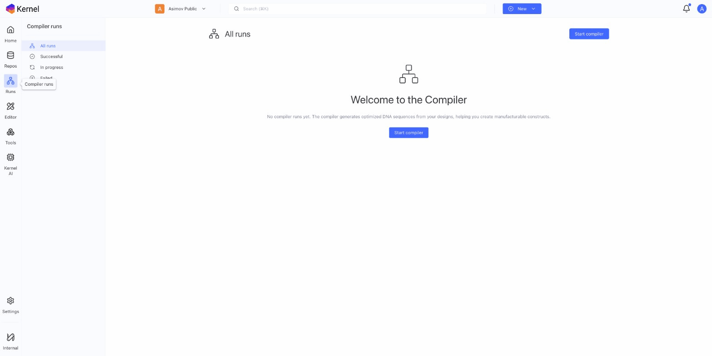

# Runs History

Track and manage your simulation and optimization runs.

## Accessing Runs

Click **Runs** in the left sidebar to view all runs.

## Run Types

### Simulations

Genetic expression predictions:
- RNA polymerase flux
- Ribosome flux
- Concentration predictions

### Codon Optimizations

Sequence optimization runs:
- Input and output sequences
- Optimization parameters
- Improvement metrics

### Compiler Runs

Automated construct design:
- Input sequences
- Generated constructs
- Configuration used

## Runs List

The runs view shows:

| Column | Description |
|--------|-------------|
| Name | Run identifier or construct name |
| Type | Simulation, Optimization, Compiler |
| Status | Running, Completed, Failed |
| Created | When the run started |
| Duration | How long it took |

### Filtering Runs

Filter by:
- **Type**: Simulation, Codon Optimization, etc.
- **Status**: Completed, Running, Failed
- **Date range**: Recent, custom range
- **Created by**: Your runs or all workspace runs

### Sorting

Sort by:
- Date (newest/oldest)
- Name
- Status
- Duration

## Run Details

Click a run to view details:

### Summary

- Run type and status
- Input construct/sequence
- Parameters used
- Completion time

### Results

- Predictions and outputs
- Visualizations
- Generated files

### Related Items

- Source construct
- Output constructs
- Linked runs

## Managing Runs

### Delete Runs

1. Select runs
2. Click **Delete**
3. Confirm deletion

**Note**: Deleting a run doesn't delete associated constructs.

### Export Results

1. Open run details
2. Click **Export**
3. Choose format (CSV, JSON)
4. Download results

## Notifications

### Run Completion

Get notified when runs complete:
- Notification bell in header
- Dashboard notifications panel

### Configuring Notifications

Adjust notification preferences in **Settings**.

## Troubleshooting

### Run Failed

Check:
- Input sequence validity
- Parameter configuration
- System status

### Run Stuck

If a run takes too long:
- Check status periodically
- Contact support if needed

### Results Not Appearing

- Refresh the page
- Check run status
- Verify completion notification

## Best Practices

### Organization

- Use descriptive names for inputs
- Track which runs correspond to which designs
- Clean up old/failed runs periodically

### Comparison

- Run same analysis on related constructs
- Use consistent parameters for comparison
- Document significant findings

### Documentation

- Note important run results
- Link runs to experimental data
- Share results with team

## Next Steps

- [Simulation](simulation.md) — Run new simulations
- [Compiler](compiler.md) — Automated design
- [Codon Optimization](../sequence-tools/codon-optimization.md) — Optimize sequences
