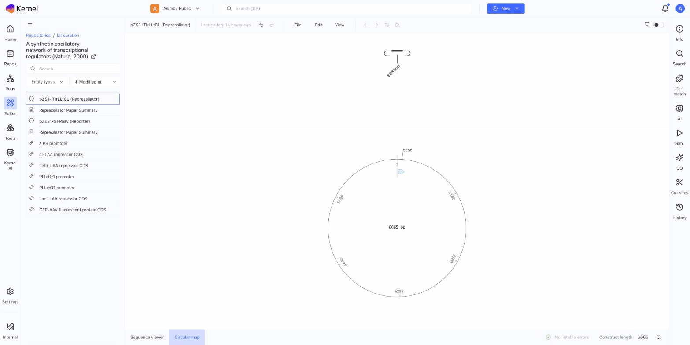

# Drag and Drop Assembly

Build constructs visually by dragging parts into the schematic view.

## Overview

Kernel's drag-and-drop interface lets you assemble and rearrange parts visually in the schematic view.

## Finding Parts

### Part Match Panel

The Part match tool analyzes your construct's sequence and suggests existing parts from your library that match regions of the sequence:

1. Open a construct in the editor
2. Click **Part match** in the right sidebar
3. Kernel scans your sequence against known parts
4. Click a suggestion to annotate that region as a part

### Global Search

To find and add new parts:

1. Press **Cmd/Ctrl + K** to open global search
2. Search by part name or type
3. Filter results to show only Parts
4. Open the part to view details or add to your construct

## Adding Parts

### Add Parts to Schematic

1. Find a part using global search (**Cmd/Ctrl + K**)
2. Open the part
3. Copy the sequence and paste into your construct
4. Or use Part match suggestions to annotate existing sequence regions

### Arranging in the Schematic

- Click and drag parts to reorder them
- A vertical line shows the insertion point when dragging
- Release to place the part at that position

## Arranging Parts

### Reorder Parts

1. In the schematic, click and drag an existing part
2. Move it to a new position
3. Release to drop

### Remove Parts

1. Click a part in the schematic to select it
2. Press **Delete** or **Backspace**
3. The part is removed and the construct rejoins

### Replace Parts

1. Drag a new part directly onto an existing part
2. The original part is replaced
3. Useful for swapping promoters, CDSs, etc.

## Working with Orientation

### Part Direction

Parts have a direction (forward or reverse):
- Forward: 5' to 3' left-to-right
- Reverse: 3' to 5' left-to-right

### Flip Orientation

1. Select a part in the schematic
2. Right-click and select **Flip orientation**
3. Or use keyboard shortcut

### Visual Indicators

- Arrow direction in symbols shows orientation
- Color may indicate strand
- Sequence viewer shows complement for reverse parts

## Multi-Part Selection

### Select Multiple Parts

- **Shift-click**: Select a range
- **Cmd/Ctrl-click**: Add individual parts to selection
- **Cmd/Ctrl-A**: Select all

### Move Multiple Parts

1. Select multiple parts
2. Drag the selection
3. All selected parts move together

### Delete Multiple Parts

1. Select multiple parts
2. Press Delete
3. All selected parts are removed

## Tips for Efficient Assembly

### Plan Your Design

1. List the parts you need
2. Determine the order
3. Check part compatibility (restriction sites, etc.)

### Use Favorites

Star frequently used parts for quick access in Part match.

### Check Sequence

After assembly:
1. Switch to sequence viewer
2. Verify junctions are correct
3. Check reading frames for CDSs

## Next Steps

- [Creating Constructs](creating-constructs.md) — Other creation methods
- [Annotations](annotations.md) — Add feature labels
- [Part Library](../parts/part-library.md) — Find more parts
