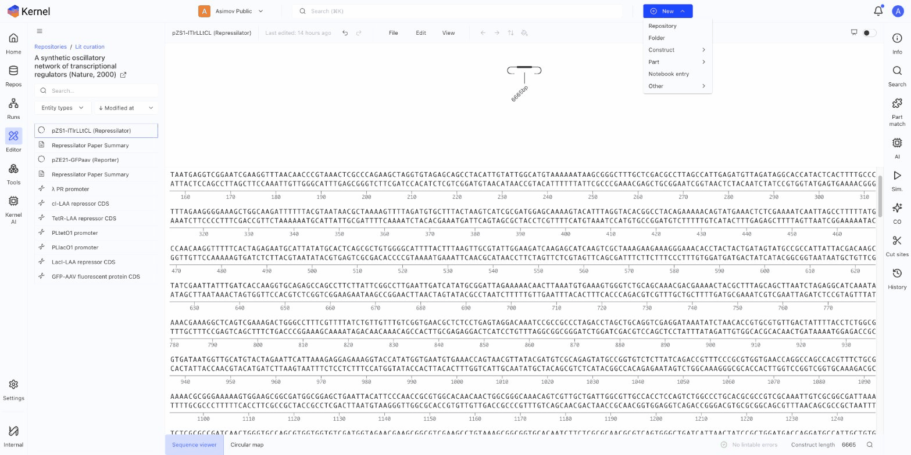
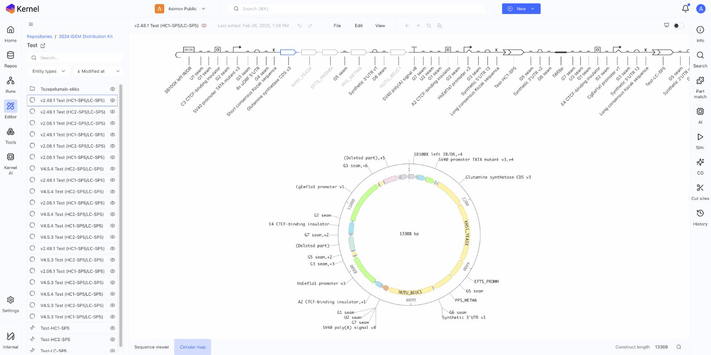
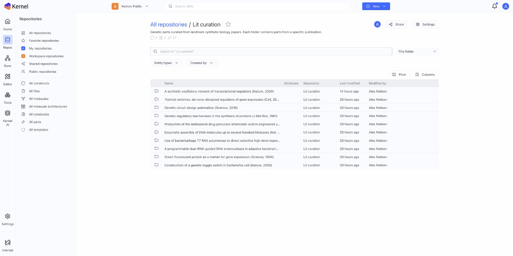
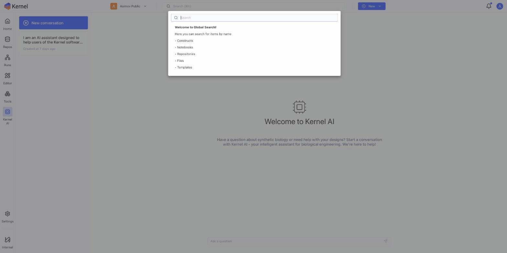

# Navigating the Interface

This guide covers Kernel's main interface elements and how to navigate between them.

## Header

The header bar contains:

- **Kernel logo**: Click to return to the dashboard
- **Workspace selector**: Switch between workspaces
- **Search**: Find constructs, parts, and files across your workspace
- **New button**: Create new repositories, constructs, parts, or notebooks
- **Notifications**: View alerts and completed runs
- **Profile**: Access account settings

## Left Sidebar

The left sidebar provides navigation to main sections:

### Home
The dashboard showing:
- Create new shortcuts
- Recent files and repositories
- Notifications feed
- Quick links to tutorials

### Repos
Browse and manage repositories:
- **All repositories**: Complete list
- **Favorite repositories**: Starred items
- **My repositories**: Created by you
- **Workspace repositories**: Shared in your workspace
- **Shared repositories**: Shared with you
- **Public repositories**: Publicly accessible

Filter by content type:
- All constructs
- All files
- All molecules
- All molecule architectures
- All notebooks
- All parts
- All templates

### Runs
View history of:
- Simulations
- Codon optimizations
- Other computational runs

### Editor
Direct access to the construct editor for quick sequence work.

### Tools
Access specialized tools in the Toolbox:
- Codon optimizer
- Antibody informatics
- Assembly design automator
- SecureDNA biosecurity scanner

### Kernel AI
AI assistant for genetic design questions and navigation.

### Settings
Configure account and workspace preferences.

## Construct Editor

The construct editor is where you design genetic sequences. It has three main areas:

### Top: Schematic View
A visual representation of your construct showing:
- Parts as symbols arranged linearly
- Part names angled above each symbol
- Color-coded part types

### Middle: Sequence View
The DNA sequence display showing:
- Nucleotide sequence with position markers
- Annotations as colored bars below the sequence
- Selection highlighting

### Bottom: View Tabs
Switch between visualization modes:
- **Sequence viewer**: Linear sequence with annotations
- **Circular map**: Plasmid map for circular constructs

### Right Sidebar Tools

The construct editor's right sidebar provides design tools:

| Tool | Function |
|------|----------|
| **Info** | View and edit construct metadata |
| **Search** | Find sequences within the construct |
| **Part match** | Identify parts that match your sequence |
| **AI** | Get AI assistance with your design |
| **Sim.** | Run genetic simulations |
| **CO** | Codon optimization |
| **Cut sites** | Analyze restriction enzyme sites |
| **History** | View revision history |

## Repository Browser

When viewing a repository:

- **Breadcrumb navigation**: Shows your location (All repositories / Repo name / Folder)
- **Share button**: Manage repository sharing
- **Settings**: Repository configuration
- **Search**: Find items within the repository
- **Filter dropdowns**: Entity types, created by
- **View toggles**: Pivot view, column view

## Search

Global search (in the header) finds content across your workspace:

1. Click the search bar or press **Cmd/Ctrl + K**
2. Type your query
3. Use arrow keys to navigate results
4. Press Enter to open a result

Filter results by type using the dropdown menus.

## Keyboard Shortcuts

Common keyboard shortcuts:

| Shortcut | Action |
|----------|--------|
| `Cmd/Ctrl + K` | Open search |
| `Esc` | Close dialogs |
| `Cmd/Ctrl + Z` | Undo |
| `Cmd/Ctrl + Shift + Z` | Redo |

## Next Steps

- [Quick Start Guide](quick-start.md) — Create your first construct
- [Creating Constructs](../constructs/creating-constructs.md) — Detailed design guide
- [Using Kernel AI](../kernel-ai/using-kernel-ai.md) — Get AI assistance
