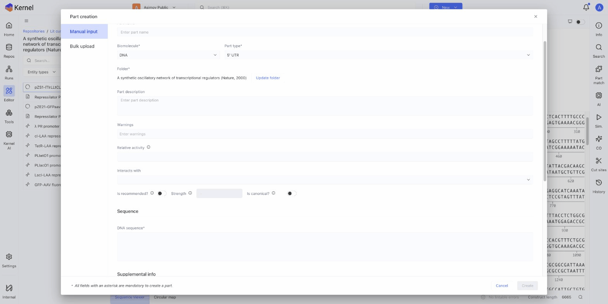

# Creating Parts

Add genetic parts to your library for reuse across constructs.

## Create a Part Manually

1. Click **New** > **Part** in the header, or use the dashboard Create new section
2. Fill in the part details:
   - **Name**: A descriptive name (e.g., "CMV Promoter")
   - **Type**: Select the part type (Promoter, CDS, Terminator, etc.)
   - **Sequence**: Enter or paste the DNA sequence
3. Add optional metadata:
   - **Description**: What the part does
   - **Attributes**: Custom fields for your workflow
4. Choose a destination repository
5. Click **Create**



## Create Parts from a Construct

Extract parts from an existing construct:

1. Open the construct in the editor
2. Select a sequence region by clicking and dragging
3. Right-click and select **Create part from selection**
4. Fill in the part details
5. Click **Create**

The new part is linked to the selected region.

## Import Parts from Files

Import parts from GenBank or other file formats:

1. Click **New** > **Part**
2. Select **Import from file**
3. Upload a GenBank (.gb), FASTA (.fasta), or DNA (.dna) file
4. Review the imported sequence and annotations
5. Set the part type and metadata
6. Click **Create**

## Bulk Part Import

Import multiple parts at once using CSV:

1. Prepare a CSV file with columns:
   - `name` (required)
   - `sequence` (required)
   - `type` (required)
   - `description` (optional)
   - Additional attribute columns as needed

2. Go to **Tools** > **Bulk Import**
3. Upload your CSV file
4. Map columns to part fields
5. Select a destination repository
6. Click **Import**

### CSV Example

```csv
name,sequence,type,description
T7 Promoter,TAATACGACTCACTATAGGG,Promoter,T7 RNA polymerase promoter
GFP,ATGGTGAGCAAGGGCGAGGAG...,CDS,Green fluorescent protein
BGH Terminator,CTGTGCCTTCTAGTTGCCAGC...,Terminator,Bovine growth hormone terminator
```

## Edit a Part

1. Navigate to the part in a repository or search for it
2. Double-click to open
3. Modify the sequence, type, or metadata
4. Changes save automatically (or click Save)

## Part Versioning

Kernel tracks part revisions:

- View history in the **History** panel
- See what changed between versions
- Parts used in constructs reference specific versions

## Best Practices

### Naming Conventions
- Use descriptive names: "CMV Promoter" not "Promoter1"
- Include version if relevant: "Kozak v2"
- Be consistent across your team

### Metadata
- Always set the correct part type
- Add descriptions for future reference
- Use attributes for searchable metadata (organism, source paper, etc.)

### Organization
- Create dedicated parts repositories
- Use folders to organize by type or project
- Share commonly used parts workspace-wide

## Next Steps

- [Part Library](part-library.md) — Access public parts
- [What is a Part?](what-is-a-part.md) — Part types and properties
- [Drag and Drop Assembly](../constructs/drag-and-drop.md) — Build constructs from parts
