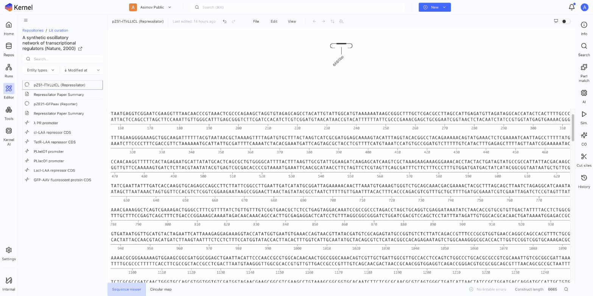

# Sequence Viewer

The sequence viewer displays DNA sequences with annotations and interactive features.

## Overview

The sequence viewer shows:
- Nucleotide sequence (A, T, G, C)
- Position markers
- Annotations as colored tracks
- Selection highlighting

## Navigating the Sequence

### Scroll

- Use mouse wheel to scroll through the sequence
- Click and drag in the sequence area

### Jump to Position

1. Click the position indicator in the status bar
2. Enter a position number
3. Press Enter to jump

### Zoom

- Zoom in to see individual nucleotides
- Zoom out to see the full sequence overview

## Selecting Sequence

### Click and Drag

1. Click at the start position
2. Drag to the end position
3. Release to complete selection

### Keyboard Selection

1. Click to position cursor
2. Hold Shift and use arrow keys
3. Or Shift-click at end position

### Select All

Press **Cmd/Ctrl + A** to select the entire sequence.

## Selection Information

When sequence is selected, the status bar shows:
- **Start**: Beginning position
- **End**: Ending position
- **Selection**: Number of bases selected
- **GC%**: GC content of selection
- **Melting temp**: Estimated Tm

## Working with Selections

### Copy Selection

1. Select sequence
2. Press **Cmd/Ctrl + C**
3. Paste as nucleotide text

### Copy Options

Right-click selection for options:
- **Copy sequence**: Nucleotide sequence
- **Copy reverse complement**: Reverse complement
- **Copy amino acid translation**: Translated sequence (for CDS regions)

### Create Annotation

1. Select sequence
2. Right-click > **Create annotation**
3. Fill in annotation details
4. Click Create

### Create Part

1. Select sequence
2. Right-click > **Create part from selection**
3. Enter part details
4. Save to your parts library

## Annotations Track

Annotations appear below the sequence:

### Viewing Annotations

- Colored bars indicate annotated regions
- Labels show annotation names
- Click an annotation to select it

### Annotation Details

Click an annotation to see:
- Name and type
- Position (start, end)
- Direction (forward/reverse)
- Additional properties

### Managing Visibility

1. Click **View** menu
2. Select annotation types to show/hide
3. Simplify view for complex constructs

## Sequence Display Options

### Translation

Show amino acid translation:
1. Select a CDS annotation or region
2. Translation appears above/below sequence
3. View reading frame

### Complement Strand

Toggle complement strand display:
- Shows both strands
- Useful for primer design
- Toggle in View menu

### ORF Highlighting

Highlight open reading frames:
1. **View** > **Show ORFs**
2. ORFs highlighted in sequence
3. Click to see ORF details

## Status Bar

The bottom status bar shows:
- Current position
- Construct length (bp)
- Selection range
- GC content
- Melting temperature

## Keyboard Shortcuts

| Shortcut | Action |
|----------|--------|
| Arrow keys | Move cursor |
| Shift + Arrow | Extend selection |
| Cmd/Ctrl + A | Select all |
| Cmd/Ctrl + C | Copy |
| Cmd/Ctrl + F | Find in sequence |
| Home | Go to start |
| End | Go to end |

## Next Steps

- [Codon Optimization](codon-optimization.md) — Optimize sequences
- [Sequence Analysis](analysis.md) — Analyze properties
- [Annotations](../constructs/annotations.md) — Label features
